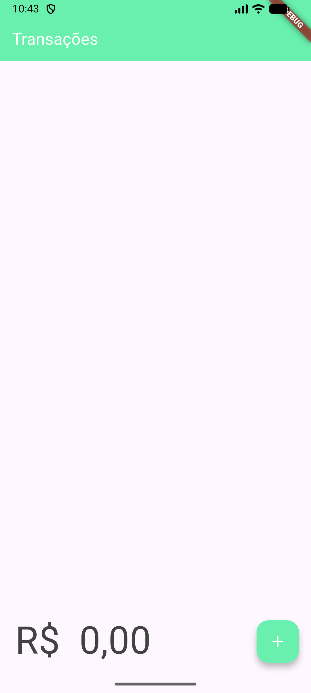
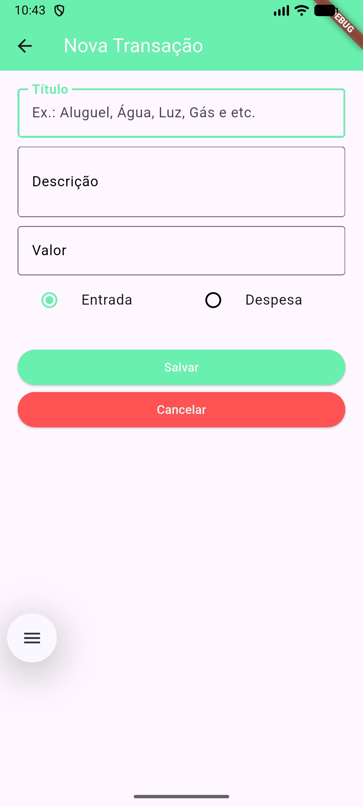
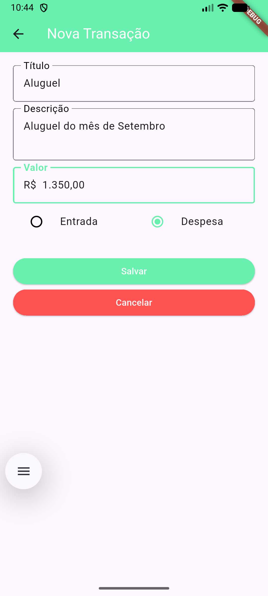
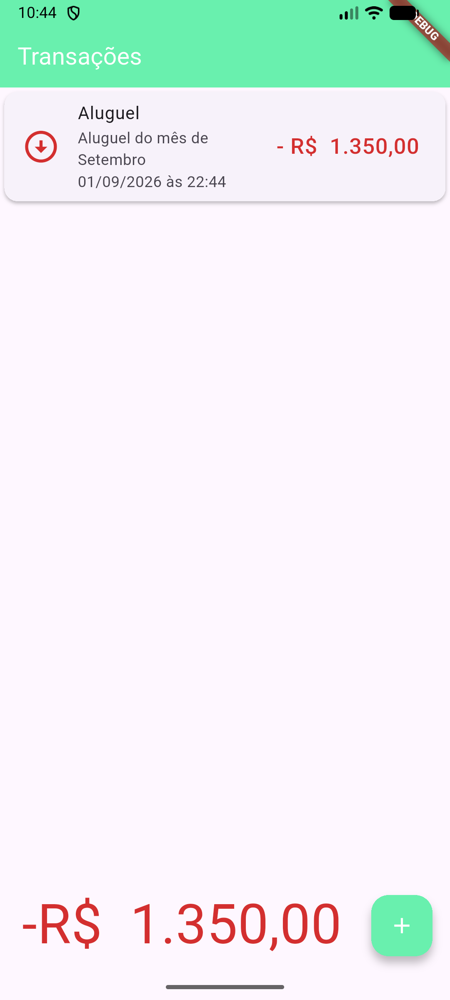
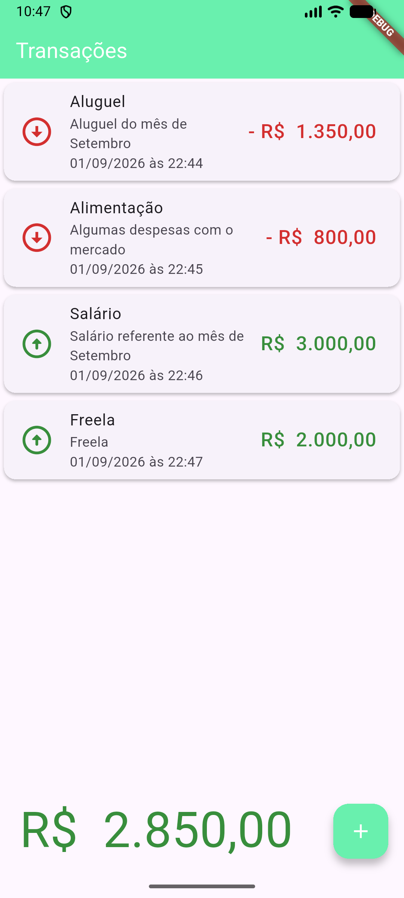
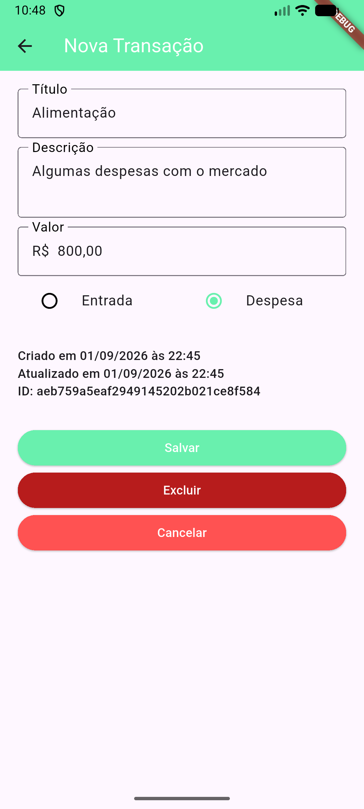
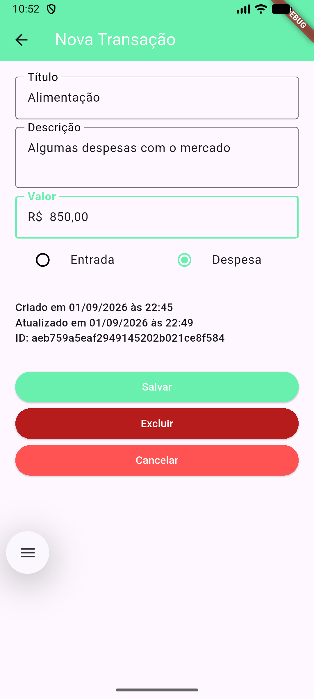
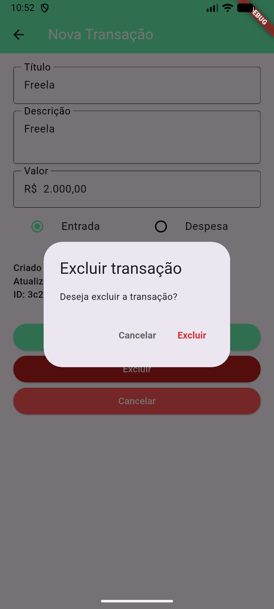
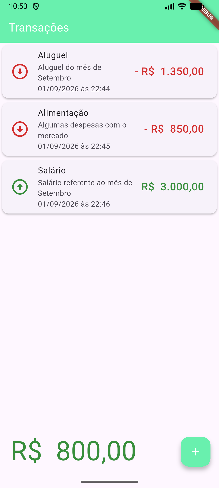
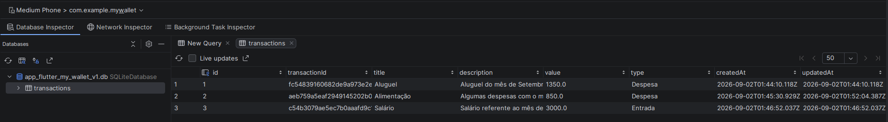

# MyWallet

## Introdução

Este é um aplicativo desenvolvido com Flutter e Dart como parte dos estudos da disciplina Desenvolvimento Multiplataforma 3 do curso de Especialização em Desenvolvimento de Sistemas para Dispositivos Móveis do IFSP - Câmpus São Carlos.

O objetivo deste projeto é desenvolver um aplicativo multiplataforma para o gerenciamento de transações financeiras, explorando listas, navegação entre telas e armazenamento local com SQLite. A aplicação permite cadastrar, consultar, editar e excluir informações de forma persistente no dispositivo.

## Sobre o aplicativo

O MyWallet permite registrar entradas e despesas informando título, descrição, valor e tipo da transação. Os registros são apresentados em uma lista com data, valor e identificação visual: entradas aparecem em verde e despesas em vermelho.

O saldo total é calculado automaticamente a partir das transações cadastradas e sua cor indica a situação financeira atual. Ao selecionar uma transação, é possível consultar seus dados, editar as informações ou excluí-la após uma confirmação.

Os dados são armazenados localmente em um banco SQLite e permanecem disponíveis mesmo após o encerramento do aplicativo.

## Funcionalidades

- Cadastro de entradas e despesas;
- Listagem das transações financeiras;
- Exibição de título, descrição, data, tipo e valor;
- Cálculo automático do saldo total;
- Identificação visual de entradas, despesas e saldo;
- Consulta e edição de transações;
- Confirmação antes da exclusão;
- Persistência local dos dados com SQLite.

## Tecnologias utilizadas

- Flutter
- Dart
- SQLite

## Bibliotecas utilizadas

- `sqflite`
- `path_provider`
- `intl`
- `currency_text_input_formatter`

## Como executar

Certifique-se de que o Flutter esteja instalado e configurado. Em seguida, instale as dependências do projeto:

```bash
flutter pub get
```

Conecte um dispositivo ou inicie um emulador e execute o aplicativo:

```bash
flutter run
```

Para gerar um APK de depuração para Android:

```bash
flutter build apk --debug
```

## Screenshots

### Cadastro de transações

<p>
  
  
  
</p>

### Lista e saldo

<p>
  
  
  
</p>

### Detalhes, edição e exclusão

<p>
  
  
  
  
</p>

### Armazenamento local

<p>
  
</p>
